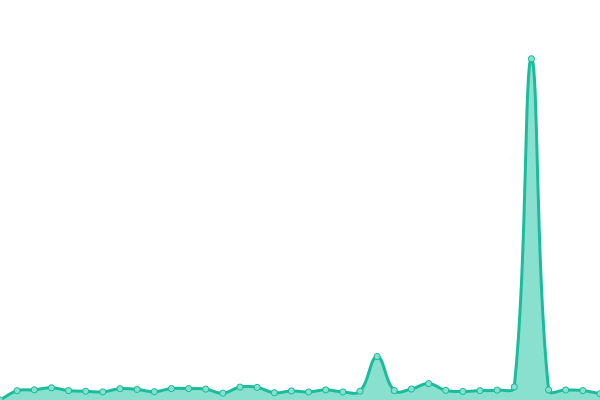

# [📈 Live Status](https://status.fediverse.kr): <!--live status--> **🟧 Partial outage**

This repository contains the open-source uptime monitor and status page for [Revinet Status Pages](https://status.fediverse.kr), powered by [Upptime](https://github.com/upptime/upptime).

With [Upptime](https://upptime.js.org), you can get your own unlimited and free uptime monitor and status page, powered entirely by a GitHub repository. We use [Issues](https://github.com/revinet-status/k-fediverse-status/issues) as incident reports, [Actions](https://github.com/revinet-status/k-fediverse-status/actions) as uptime monitors, and [Pages](https://status.fediverse.kr) for the status page.

<!--start: status pages-->
<!-- This summary is generated by Upptime (https://github.com/upptime/upptime) -->
<!-- Do not edit this manually, your changes will be overwritten -->
<!-- prettier-ignore -->
| URL | Status | History | Response Time | Uptime |
| --- | ------ | ------- | ------------- | ------ |
|  [planet.moe](https://planet.moe/nodeinfo/2.0) | 🟩 Up | [planet-moe.yml](https://github.com/revinet-status/k-fediverse-status/commits/HEAD/history/planet-moe.yml) | 

 851ms
     
 | 

<a href="https://status.fediverse.kr/history/planet-moe">100.00%</a>
    

|  [amaurot.city](https://amaurot.city/nodeinfo/2.0) | 🟩 Up | [amaurot-city.yml](https://github.com/revinet-status/k-fediverse-status/commits/HEAD/history/amaurot-city.yml) | 

 645ms
     
 | 

<a href="https://status.fediverse.kr/history/amaurot-city">100.00%</a>
    

|  [Aniwork Network](https://ani.work/nodeinfo/2.0) | 🟩 Up | [aniwork-network.yml](https://github.com/revinet-status/k-fediverse-status/commits/HEAD/history/aniwork-network.yml) | 

 273ms
     
 | 

<a href="https://status.fediverse.kr/history/aniwork-network">100.00%</a>
    

|  [ChalkBoard](https://chalk.moe/nodeinfo/2.0) | 🟩 Up | [chalk-board.yml](https://github.com/revinet-status/k-fediverse-status/commits/HEAD/history/chalk-board.yml) | 

 708ms
     
 | 

<a href="https://status.fediverse.kr/history/chalk-board">100.00%</a>
    

|  [Dimension](https://dimension.host/nodeinfo/2.0) | 🟩 Up | [dimension.yml](https://github.com/revinet-status/k-fediverse-status/commits/HEAD/history/dimension.yml) | 

 562ms
     
 | 

<a href="https://status.fediverse.kr/history/dimension">100.00%</a>
    

|  [naru.cafe DON](https://don.naru.cafe/nodeinfo/2.0) | 🟩 Up | [naru-cafe-don.yml](https://github.com/revinet-status/k-fediverse-status/commits/HEAD/history/naru-cafe-don.yml) | 

 1087ms
     
 | 

<a href="https://status.fediverse.kr/history/naru-cafe-don">99.14%</a>
    

|  [HotoMoe](https://hoto.moe/nodeinfo/2.0) | 🟩 Up | [hoto-moe.yml](https://github.com/revinet-status/k-fediverse-status/commits/HEAD/history/hoto-moe.yml) | 

 664ms
     
 | 

<a href="https://status.fediverse.kr/history/hoto-moe">100.00%</a>
    

|  [Misskey.lapy](https://k.lapy.link/nodeinfo/2.0) | 🟩 Up | [misskey-lapy.yml](https://github.com/revinet-status/k-fediverse-status/commits/HEAD/history/misskey-lapy.yml) | 

 566ms
     
 | 

<a href="https://status.fediverse.kr/history/misskey-lapy">98.94%</a>
    

|  [madost.one](https://madost.one/nodeinfo/2.0) | 🟩 Up | [madost-one.yml](https://github.com/revinet-status/k-fediverse-status/commits/HEAD/history/madost-one.yml) | 

 594ms
     
 | 

<a href="https://status.fediverse.kr/history/madost-one">100.00%</a>
    

|  [masost.one](https://masost.one/nodeinfo/2.0) | 🟩 Up | [masost-one.yml](https://github.com/revinet-status/k-fediverse-status/commits/HEAD/history/masost-one.yml) | 

 262ms
     
 | 

<a href="https://status.fediverse.kr/history/masost-one">100.00%</a>
    

|  [mustard.blog](https://mustard.blog/nodeinfo/2.0) | 🟩 Up | [mustard-blog.yml](https://github.com/revinet-status/k-fediverse-status/commits/HEAD/history/mustard-blog.yml) | 

 862ms
     
 | 

<a href="https://status.fediverse.kr/history/mustard-blog">99.49%</a>
    

|  [qdon.space](https://qdon.space/nodeinfo/2.0) | 🟩 Up | [qdon-space.yml](https://github.com/revinet-status/k-fediverse-status/commits/HEAD/history/qdon-space.yml) | 

 1255ms
     
 | 

<a href="https://status.fediverse.kr/history/qdon-space">99.92%</a>
    

|  [Old Sharlayan](https://old.sharlayan.city/nodeinfo/2.0) | 🟩 Up | [old-sharlayan.yml](https://github.com/revinet-status/k-fediverse-status/commits/HEAD/history/old-sharlayan.yml) | 

 722ms
     
 | 

<a href="https://status.fediverse.kr/history/old-sharlayan">99.99%</a>
    

|  [SiFNet](https://social.silicon.moe/nodeinfo/2.0) | 🟩 Up | [si-f-net.yml](https://github.com/revinet-status/k-fediverse-status/commits/HEAD/history/si-f-net.yml) | 

 319ms
     
 | 

<a href="https://status.fediverse.kr/history/si-f-net">99.80%</a>
    

|  [YuruToot](https://toot.funami.tech/nodeinfo/2.0) | 🟩 Up | [yuru-toot.yml](https://github.com/revinet-status/k-fediverse-status/commits/HEAD/history/yuru-toot.yml) | 

 534ms
     
 | 

<a href="https://status.fediverse.kr/history/yuru-toot">99.38%</a>
    

|  [uri.life](https://uri.life/nodeinfo/2.0) | 🟩 Up | [uri-life.yml](https://github.com/revinet-status/k-fediverse-status/commits/HEAD/history/uri-life.yml) | 

 430ms
     
 | 

<a href="https://status.fediverse.kr/history/uri-life">99.09%</a>
    

|  [yoyang.one](https://yoyang.one/nodeinfo/2.0) | 🟩 Up | [yoyang-one.yml](https://github.com/revinet-status/k-fediverse-status/commits/HEAD/history/yoyang-one.yml) | 

 270ms
     
 | 

<a href="https://status.fediverse.kr/history/yoyang-one">100.00%</a>
    

|  [Bunbers](https://bunbers.org/nodeinfo/2.0.json) | 🟩 Up | [bunbers.yml](https://github.com/revinet-status/k-fediverse-status/commits/HEAD/history/bunbers.yml) | 

 806ms
     
 | 

<a href="https://status.fediverse.kr/history/bunbers">100.00%</a>
    

|  [Twingyeo](https://twingyeo.kr/nodeinfo/2.0) | 🟩 Up | [twingyeo.yml](https://github.com/revinet-status/k-fediverse-status/commits/HEAD/history/twingyeo.yml) | 

 880ms
     
 | 

<a href="https://status.fediverse.kr/history/twingyeo">100.00%</a>
    

|  [jmm](https://jmm.kr/nodeinfo/2.0) | 🟩 Up | [jmm.yml](https://github.com/revinet-status/k-fediverse-status/commits/HEAD/history/jmm.yml) | 

 701ms
     
 | 

<a href="https://status.fediverse.kr/history/jmm">100.00%</a>
    

|  [maratang.life](https://maratang.life/nodeinfo/2.0) | 🟩 Up | [maratang-life.yml](https://github.com/revinet-status/k-fediverse-status/commits/HEAD/history/maratang-life.yml) | 

 525ms
     
 | 

<a href="https://status.fediverse.kr/history/maratang-life">100.00%</a>
    

|  [kurry.social](https://kurry.social/nodeinfo/2.0) | 🟩 Up | [kurry-social.yml](https://github.com/revinet-status/k-fediverse-status/commits/HEAD/history/kurry-social.yml) | 

 673ms
     
 | 

<a href="https://status.fediverse.kr/history/kurry-social">99.93%</a>
    

|  [pointless.chat](https://pointless.chat/nodeinfo/2.0) | 🟩 Up | [pointless-chat.yml](https://github.com/revinet-status/k-fediverse-status/commits/HEAD/history/pointless-chat.yml) | 

 765ms
     
 | 

<a href="https://status.fediverse.kr/history/pointless-chat">99.10%</a>
    

|  [muri.network](https://muri.network/nodeinfo/2.0) | 🟩 Up | [muri-network.yml](https://github.com/revinet-status/k-fediverse-status/commits/HEAD/history/muri-network.yml) | 

 2111ms
     
 | 

<a href="https://status.fediverse.kr/history/muri-network">97.00%</a>
    

|  [netsphere.one](https://netsphere.one/nodeinfo/2.0) | 🟩 Up | [netsphere-one.yml](https://github.com/revinet-status/k-fediverse-status/commits/HEAD/history/netsphere-one.yml) | 

 756ms
     
 | 

<a href="https://status.fediverse.kr/history/netsphere-one">97.01%</a>
    

|  [mnetwork.co.kr](https://mastodon.mnetwork.co.kr/nodeinfo/2.0) | 🟩 Up | [mnetwork-co-kr.yml](https://github.com/revinet-status/k-fediverse-status/commits/HEAD/history/mnetwork-co-kr.yml) | 

 436ms
     
 | 

<a href="https://status.fediverse.kr/history/mnetwork-co-kr">99.94%</a>
    

|  [t.chadole.com](https://t.chadole.com/nodeinfo/2.0) | 🟩 Up | [t-chadole-com.yml](https://github.com/revinet-status/k-fediverse-status/commits/HEAD/history/t-chadole-com.yml) | 

 456ms
     
 | 

<a href="https://status.fediverse.kr/history/t-chadole-com">100.00%</a>
    

|  [krpgpub.net](https://krpgpub.net/nodeinfo/2.0) | 🟩 Up | [krpgpub-net.yml](https://github.com/revinet-status/k-fediverse-status/commits/HEAD/history/krpgpub-net.yml) | 

 487ms
     
 | 

<a href="https://status.fediverse.kr/history/krpgpub-net">99.84%</a>
    

|  [bakedbean.xyz](https://bakedbean.xyz/nodeinfo/2.0) | 🟩 Up | [bakedbean-xyz.yml](https://github.com/revinet-status/k-fediverse-status/commits/HEAD/history/bakedbean-xyz.yml) | 

 828ms
     
 | 

<a href="https://status.fediverse.kr/history/bakedbean-xyz">99.79%</a>
    

|  [kono.pub](https://kono.pub/nodeinfo/2.0) | 🟩 Up | [kono-pub.yml](https://github.com/revinet-status/k-fediverse-status/commits/HEAD/history/kono-pub.yml) | 

 478ms
     
 | 

<a href="https://status.fediverse.kr/history/kono-pub">100.00%</a>
    

|  [trpg-o.xyz](https://trpg-o.xyz/nodeinfo/2.0) | 🟩 Up | [trpg-o-xyz.yml](https://github.com/revinet-status/k-fediverse-status/commits/HEAD/history/trpg-o-xyz.yml) | 

 559ms
     
 | 

<a href="https://status.fediverse.kr/history/trpg-o-xyz">100.00%</a>
    

|  [s.mysw.moe](https://s.mysw.moe/nodeinfo/2.0) | 🟩 Up | [s-mysw-moe.yml](https://github.com/revinet-status/k-fediverse-status/commits/HEAD/history/s-mysw-moe.yml) | 

 769ms
     
 | 

<a href="https://status.fediverse.kr/history/s-mysw-moe">99.90%</a>
    

|  [buttersc.one](https://buttersc.one/nodeinfo/2.0) | 🟩 Up | [buttersc-one.yml](https://github.com/revinet-status/k-fediverse-status/commits/HEAD/history/buttersc-one.yml) | 

 696ms
     
 | 

<a href="https://status.fediverse.kr/history/buttersc-one">99.80%</a>
    

|  [stella.place](https://stella.place/nodeinfo/2.0) | 🟩 Up | [stella-place.yml](https://github.com/revinet-status/k-fediverse-status/commits/HEAD/history/stella-place.yml) | 

 294ms
     
 | 

<a href="https://status.fediverse.kr/history/stella-place">100.00%</a>
    

|  [iqhina.org](https://iqhina.org/nodeinfo/2.0) | 🟩 Up | [iqhina-org.yml](https://github.com/revinet-status/k-fediverse-status/commits/HEAD/history/iqhina-org.yml) | 

 621ms
     
 | 

<a href="https://status.fediverse.kr/history/iqhina-org">99.71%</a>
    

|  [sharlayan.in](https://sharlayan.in/nodeinfo/2.0) | 🟩 Up | [sharlayan-in.yml](https://github.com/revinet-status/k-fediverse-status/commits/HEAD/history/sharlayan-in.yml) | 

 797ms
     
 | 

<a href="https://status.fediverse.kr/history/sharlayan-in">99.61%</a>
    

|  [Cerulean.ink](https://cerulean.ink/nodeinfo/2.0.json) | 🟥 Down | [cerulean-ink.yml](https://github.com/revinet-status/k-fediverse-status/commits/HEAD/history/cerulean-ink.yml) | 

 187ms
     
 | 

<a href="https://status.fediverse.kr/history/cerulean-ink">0.00%</a>
    

|  [KitsuneSoba](https://kitsunesoba.com/nodeinfo/2.0) | 🟩 Up | [kitsune-soba.yml](https://github.com/revinet-status/k-fediverse-status/commits/HEAD/history/kitsune-soba.yml) | 

 669ms
     
 | 

<a href="https://status.fediverse.kr/history/kitsune-soba">99.94%</a>
    

|  [Catsword.social](https://catswords.social/nodeinfo/2.0) | 🟩 Up | [catsword-social.yml](https://github.com/revinet-status/k-fediverse-status/commits/HEAD/history/catsword-social.yml) | 

 762ms
     
 | 

<a href="https://status.fediverse.kr/history/catsword-social">99.94%</a>
    

|  [duk.space](https://duk.space/nodeinfo/2.0) | 🟩 Up | [duk-space.yml](https://github.com/revinet-status/k-fediverse-status/commits/HEAD/history/duk-space.yml) | 

 579ms
     
 | 

<a href="https://status.fediverse.kr/history/duk-space">100.00%</a>
    

|  [mst.canor.kr](https://mst.canor.kr/nodeinfo/2.0) | 🟩 Up | [mst-canor-kr.yml](https://github.com/revinet-status/k-fediverse-status/commits/HEAD/history/mst-canor-kr.yml) | 

 825ms
     
 | 

<a href="https://status.fediverse.kr/history/mst-canor-kr">100.00%</a>
    

|  [msk.canor.kr](https://msk.canor.kr/nodeinfo/2.0) | 🟩 Up | [msk-canor-kr.yml](https://github.com/revinet-status/k-fediverse-status/commits/HEAD/history/msk-canor-kr.yml) | 

 875ms
     
 | 

<a href="https://status.fediverse.kr/history/msk-canor-kr">100.00%</a>
    

|  [serafuku.moe](https://serafuku.moe/nodeinfo/2.0) | 🟩 Up | [serafuku-moe.yml](https://github.com/revinet-status/k-fediverse-status/commits/HEAD/history/serafuku-moe.yml) | 

 644ms
     
 | 

<a href="https://status.fediverse.kr/history/serafuku-moe">100.00%</a>
    

|  [FediverseWiki](https://wiki.mastodon.kr/w/api.php?action=query&meta=siteinfo&siprop=statistics&format=json) | 🟩 Up | [fediverse-wiki.yml](https://github.com/revinet-status/k-fediverse-status/commits/HEAD/history/fediverse-wiki.yml) | 

 1406ms
     
 | 

<a href="https://status.fediverse.kr/history/fediverse-wiki">98.67%</a>
    

|  [interstellar.flights](https://ap.interstellar.flights/) | 🟩 Up | [interstellar-flights.yml](https://github.com/revinet-status/k-fediverse-status/commits/HEAD/history/interstellar-flights.yml) | 

 478ms
     
 | 

<a href="https://status.fediverse.kr/history/interstellar-flights">100.00%</a>
    

|  [relay.musubi.moe](https://relay.musubi.moe/) | 🟩 Up | [relay-musubi-moe.yml](https://github.com/revinet-status/k-fediverse-status/commits/HEAD/history/relay-musubi-moe.yml) | 

 306ms
     
 | 

<a href="https://status.fediverse.kr/history/relay-musubi-moe">99.93%</a>
    

|  [relay.pointless.chat](https://relay.pointless.chat/) | 🟩 Up | [relay-pointless-chat.yml](https://github.com/revinet-status/k-fediverse-status/commits/HEAD/history/relay-pointless-chat.yml) | 

 708ms
     
 | 

<a href="https://status.fediverse.kr/history/relay-pointless-chat">99.95%</a>
    

<!--end: status pages-->

[**Visit our status website →**](https://status.fediverse.kr)

## 📄 License

- Powered by: [Upptime](https://github.com/upptime/upptime)
- Code: [MIT](./LICENSE) © [Revinet Status Pages](https://status.fediverse.kr)
- Data in the `./history` directory: [Open Database License](https://opendatacommons.org/licenses/odbl/1-0/)
