# [📈 Live Status](https://status.fediverse.kr): <!--live status--> **🟧 Partial outage**

This repository contains the open-source uptime monitor and status page for [Revinet Status Pages](https://status.fediverse.kr), powered by [Upptime](https://github.com/upptime/upptime).

With [Upptime](https://upptime.js.org), you can get your own unlimited and free uptime monitor and status page, powered entirely by a GitHub repository. We use [Issues](https://github.com/revinet-status/k-fediverse-status/issues) as incident reports, [Actions](https://github.com/revinet-status/k-fediverse-status/actions) as uptime monitors, and [Pages](https://status.fediverse.kr) for the status page.

<!--start: status pages-->
<!-- This summary is generated by Upptime (https://github.com/upptime/upptime) -->
<!-- Do not edit this manually, your changes will be overwritten -->
<!-- prettier-ignore -->
| URL | Status | History | Response Time | Uptime |
| --- | ------ | ------- | ------------- | ------ |
|  [planet.moe](https://planet.moe/nodeinfo/2.0) | 🟩 Up | [planet-moe.yml](https://github.com/revinet-status/k-fediverse-status/commits/HEAD/history/planet-moe.yml) | 

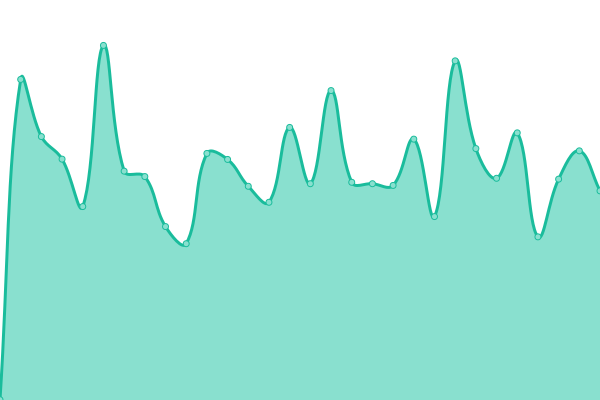 881ms
     
 | 

<a href="https://status.fediverse.kr/history/planet-moe">100.00%</a>
    

|  [amaurot.city](https://amaurot.city/nodeinfo/2.0) | 🟩 Up | [amaurot-city.yml](https://github.com/revinet-status/k-fediverse-status/commits/HEAD/history/amaurot-city.yml) | 

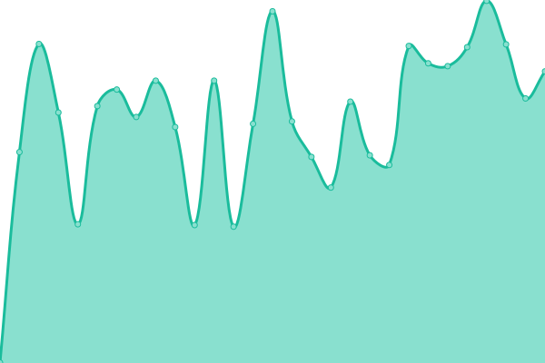 603ms
     
 | 

<a href="https://status.fediverse.kr/history/amaurot-city">100.00%</a>
    

|  [Aniwork Network](https://ani.work/nodeinfo/2.0) | 🟩 Up | [aniwork-network.yml](https://github.com/revinet-status/k-fediverse-status/commits/HEAD/history/aniwork-network.yml) | 

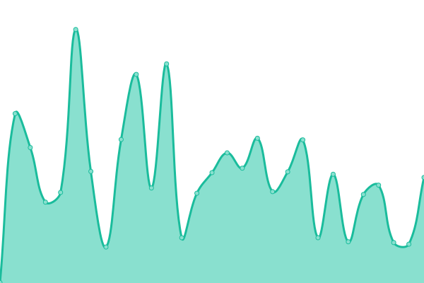 191ms
     
 | 

<a href="https://status.fediverse.kr/history/aniwork-network">100.00%</a>
    

|  [ChalkBoard](https://chalk.moe/nodeinfo/2.0) | 🟩 Up | [chalk-board.yml](https://github.com/revinet-status/k-fediverse-status/commits/HEAD/history/chalk-board.yml) | 

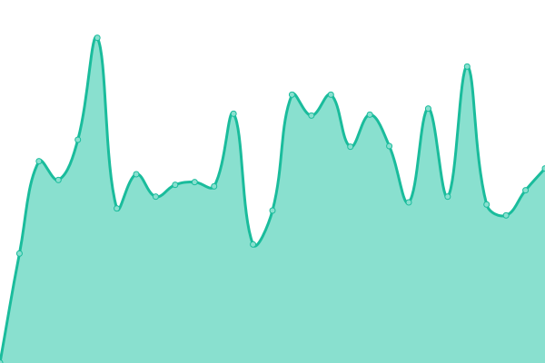 628ms
     
 | 

<a href="https://status.fediverse.kr/history/chalk-board">100.00%</a>
    

|  [Dimension](https://dimension.host/nodeinfo/2.0) | 🟩 Up | [dimension.yml](https://github.com/revinet-status/k-fediverse-status/commits/HEAD/history/dimension.yml) | 

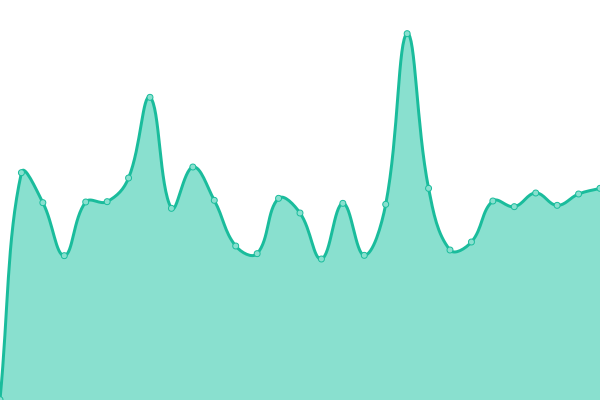 560ms
     
 | 

<a href="https://status.fediverse.kr/history/dimension">100.00%</a>
    

|  [HotoMoe](https://hoto.moe/nodeinfo/2.0) | 🟩 Up | [hoto-moe.yml](https://github.com/revinet-status/k-fediverse-status/commits/HEAD/history/hoto-moe.yml) | 

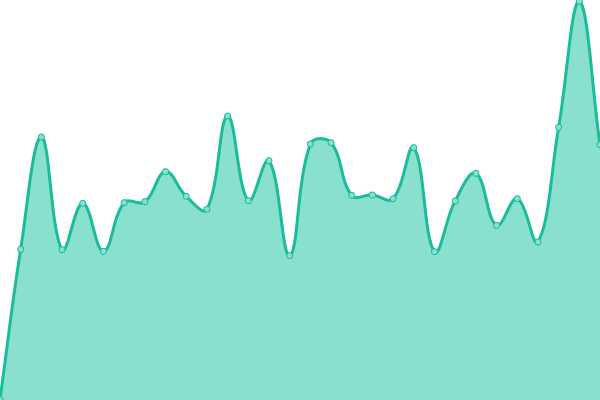 690ms
     
 | 

<a href="https://status.fediverse.kr/history/hoto-moe">98.45%</a>
    

|  [Misskey.lapy](https://k.lapy.link/nodeinfo/2.0) | 🟩 Up | [misskey-lapy.yml](https://github.com/revinet-status/k-fediverse-status/commits/HEAD/history/misskey-lapy.yml) | 

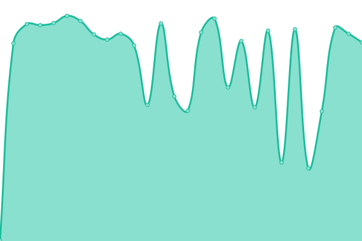 579ms
     
 | 

<a href="https://status.fediverse.kr/history/misskey-lapy">100.00%</a>
    

|  [madost.one](https://madost.one/nodeinfo/2.0) | 🟩 Up | [madost-one.yml](https://github.com/revinet-status/k-fediverse-status/commits/HEAD/history/madost-one.yml) | 

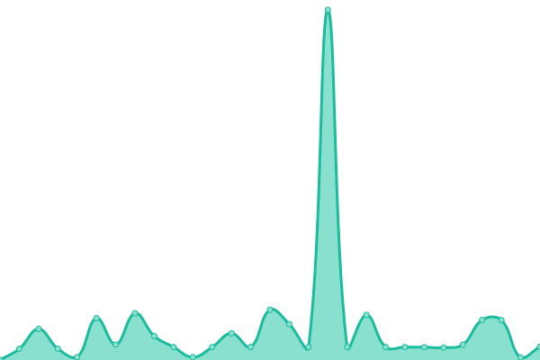 947ms
     
 | 

<a href="https://status.fediverse.kr/history/madost-one">100.00%</a>
    

|  [masost.one](https://masost.one/nodeinfo/2.0) | 🟩 Up | [masost-one.yml](https://github.com/revinet-status/k-fediverse-status/commits/HEAD/history/masost-one.yml) | 

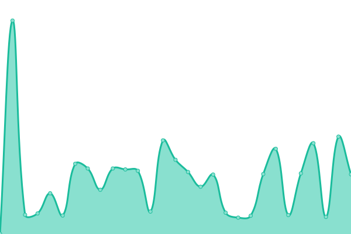 259ms
     
 | 

<a href="https://status.fediverse.kr/history/masost-one">100.00%</a>
    

|  [mustard.blog](https://mustard.blog/nodeinfo/2.0) | 🟩 Up | [mustard-blog.yml](https://github.com/revinet-status/k-fediverse-status/commits/HEAD/history/mustard-blog.yml) | 

 911ms
     
 | 

<a href="https://status.fediverse.kr/history/mustard-blog">100.00%</a>
    

|  [qdon.space](https://qdon.space/nodeinfo/2.0) | 🟩 Up | [qdon-space.yml](https://github.com/revinet-status/k-fediverse-status/commits/HEAD/history/qdon-space.yml) | 

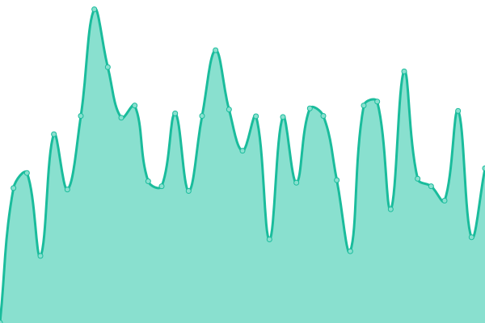 560ms
     
 | 

<a href="https://status.fediverse.kr/history/qdon-space">99.80%</a>
    

|  [Old Sharlayan](https://old.sharlayan.city/nodeinfo/2.0) | 🟩 Up | [old-sharlayan.yml](https://github.com/revinet-status/k-fediverse-status/commits/HEAD/history/old-sharlayan.yml) | 

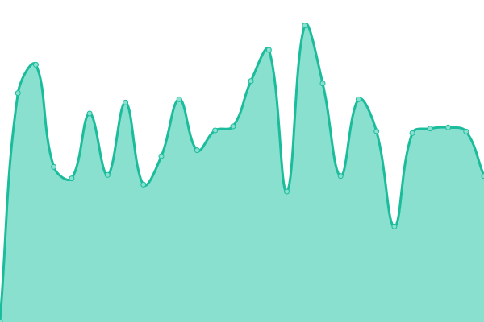 428ms
     
 | 

<a href="https://status.fediverse.kr/history/old-sharlayan">98.12%</a>
    

|  [SiFNet](https://social.silicon.moe/nodeinfo/2.0) | 🟩 Up | [si-f-net.yml](https://github.com/revinet-status/k-fediverse-status/commits/HEAD/history/si-f-net.yml) | 

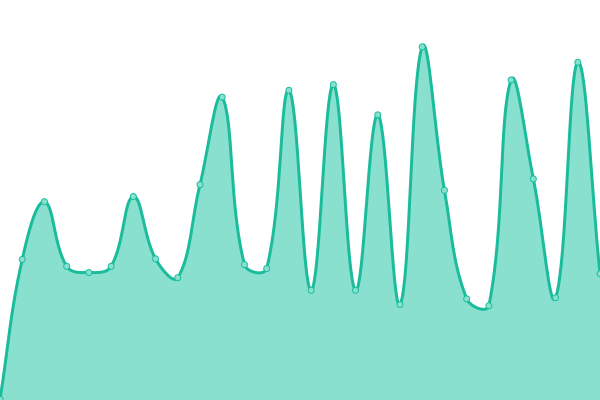 643ms
     
 | 

<a href="https://status.fediverse.kr/history/si-f-net">100.00%</a>
    

|  [YuruToot](https://toot.funami.tech/nodeinfo/2.0) | 🟩 Up | [yuru-toot.yml](https://github.com/revinet-status/k-fediverse-status/commits/HEAD/history/yuru-toot.yml) | 

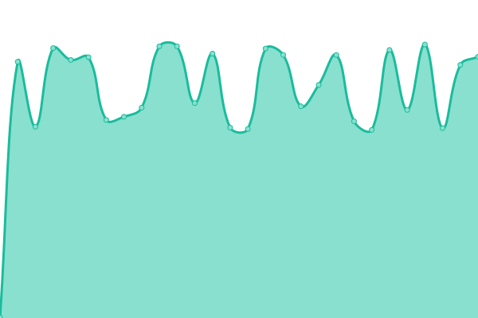 750ms
     
 | 

<a href="https://status.fediverse.kr/history/yuru-toot">99.71%</a>
    

|  [uri.life](https://uri.life/nodeinfo/2.0) | 🟩 Up | [uri-life.yml](https://github.com/revinet-status/k-fediverse-status/commits/HEAD/history/uri-life.yml) | 

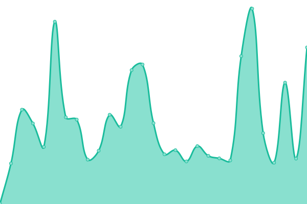 339ms
     
 | 

<a href="https://status.fediverse.kr/history/uri-life">100.00%</a>
    

|  [yoyang.one](https://yoyang.one/nodeinfo/2.0) | 🟥 Down | [yoyang-one.yml](https://github.com/revinet-status/k-fediverse-status/commits/HEAD/history/yoyang-one.yml) | 

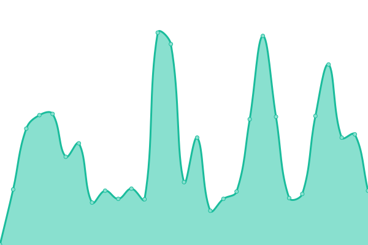 79ms
     
 | 

<a href="https://status.fediverse.kr/history/yoyang-one">0.00%</a>
    

|  [Bunbers](https://bunbers.org/nodeinfo/2.0.json) | 🟩 Up | [bunbers.yml](https://github.com/revinet-status/k-fediverse-status/commits/HEAD/history/bunbers.yml) | 

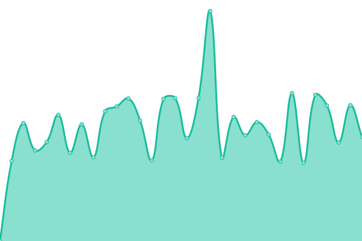 722ms
     
 | 

<a href="https://status.fediverse.kr/history/bunbers">100.00%</a>
    

|  [jmm](https://jmm.kr/nodeinfo/2.0) | 🟩 Up | [jmm.yml](https://github.com/revinet-status/k-fediverse-status/commits/HEAD/history/jmm.yml) | 

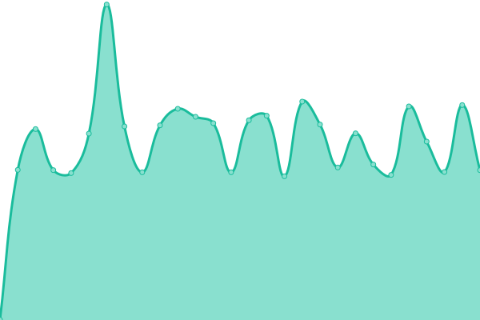 700ms
     
 | 

<a href="https://status.fediverse.kr/history/jmm">100.00%</a>
    

|  [maratang.life](https://maratang.life/nodeinfo/2.0) | 🟩 Up | [maratang-life.yml](https://github.com/revinet-status/k-fediverse-status/commits/HEAD/history/maratang-life.yml) | 

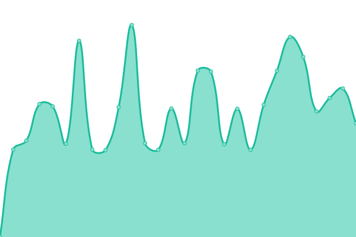 538ms
     
 | 

<a href="https://status.fediverse.kr/history/maratang-life">100.00%</a>
    

|  [kurry.social](https://kurry.social/nodeinfo/2.0) | 🟩 Up | [kurry-social.yml](https://github.com/revinet-status/k-fediverse-status/commits/HEAD/history/kurry-social.yml) | 

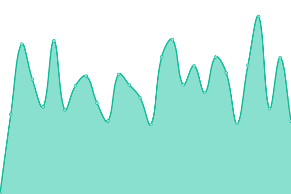 644ms
     
 | 

<a href="https://status.fediverse.kr/history/kurry-social">100.00%</a>
    

|  [pointless.chat](https://pointless.chat/nodeinfo/2.0) | 🟩 Up | [pointless-chat.yml](https://github.com/revinet-status/k-fediverse-status/commits/HEAD/history/pointless-chat.yml) | 

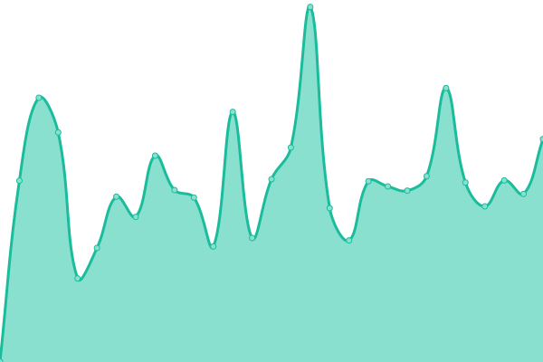 466ms
     
 | 

<a href="https://status.fediverse.kr/history/pointless-chat">100.00%</a>
    

|  [muri.network](https://muri.network/nodeinfo/2.0) | 🟩 Up | [muri-network.yml](https://github.com/revinet-status/k-fediverse-status/commits/HEAD/history/muri-network.yml) | 

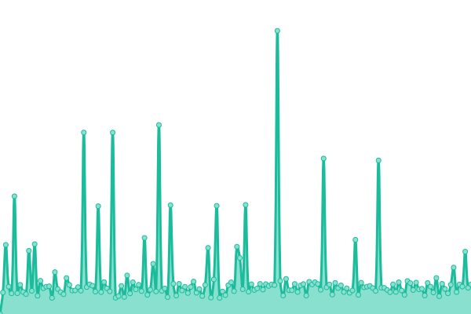 1220ms
     
 | 

<a href="https://status.fediverse.kr/history/muri-network">99.16%</a>
    

|  [netsphere.one](https://netsphere.one/nodeinfo/2.0) | 🟩 Up | [netsphere-one.yml](https://github.com/revinet-status/k-fediverse-status/commits/HEAD/history/netsphere-one.yml) | 

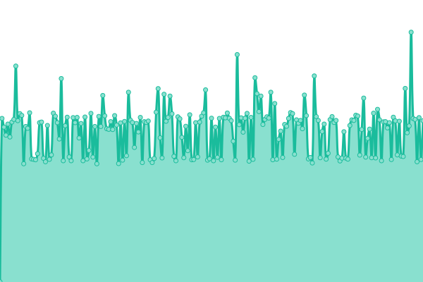 717ms
     
 | 

<a href="https://status.fediverse.kr/history/netsphere-one">99.16%</a>
    

|  [mnetwork.co.kr](https://mastodon.mnetwork.co.kr/nodeinfo/2.0) | 🟩 Up | [mnetwork-co-kr.yml](https://github.com/revinet-status/k-fediverse-status/commits/HEAD/history/mnetwork-co-kr.yml) | 

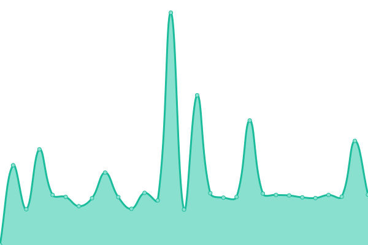 609ms
     
 | 

<a href="https://status.fediverse.kr/history/mnetwork-co-kr">100.00%</a>
    

|  [t.chadole.com](https://t.chadole.com/nodeinfo/2.0) | 🟩 Up | [t-chadole-com.yml](https://github.com/revinet-status/k-fediverse-status/commits/HEAD/history/t-chadole-com.yml) | 

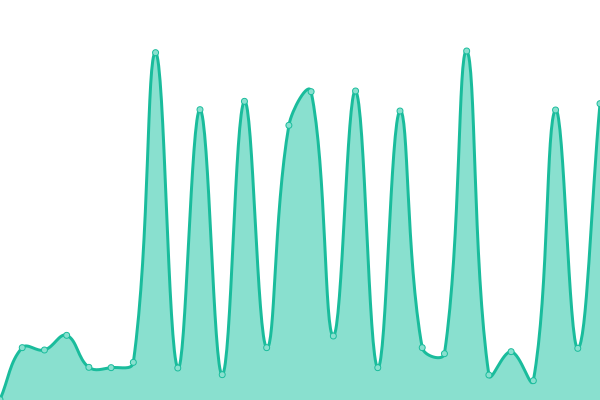 850ms
     
 | 

<a href="https://status.fediverse.kr/history/t-chadole-com">100.00%</a>
    

|  [krpgpub.net](https://krpgpub.net/nodeinfo/2.0) | 🟩 Up | [krpgpub-net.yml](https://github.com/revinet-status/k-fediverse-status/commits/HEAD/history/krpgpub-net.yml) | 

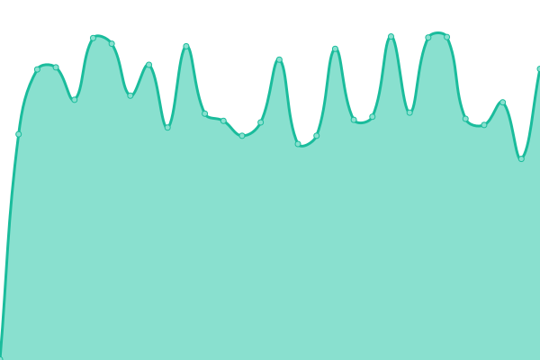 482ms
     
 | 

<a href="https://status.fediverse.kr/history/krpgpub-net">100.00%</a>
    

|  [bakedbean.xyz](https://bakedbean.xyz/nodeinfo/2.0) | 🟩 Up | [bakedbean-xyz.yml](https://github.com/revinet-status/k-fediverse-status/commits/HEAD/history/bakedbean-xyz.yml) | 

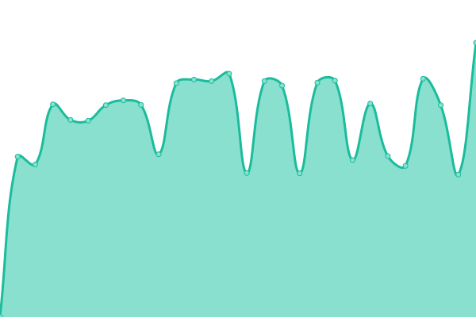 935ms
     
 | 

<a href="https://status.fediverse.kr/history/bakedbean-xyz">100.00%</a>
    

|  [kono.pub](https://kono.pub/nodeinfo/2.0) | 🟩 Up | [kono-pub.yml](https://github.com/revinet-status/k-fediverse-status/commits/HEAD/history/kono-pub.yml) | 

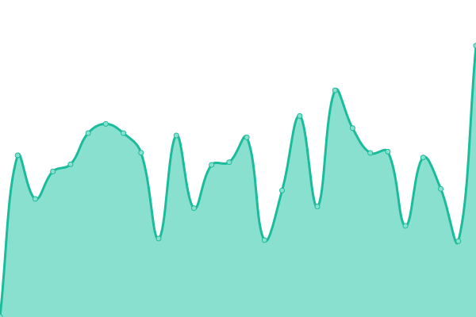 480ms
     
 | 

<a href="https://status.fediverse.kr/history/kono-pub">100.00%</a>
    

|  [trpg-o.xyz](https://trpg-o.xyz/nodeinfo/2.0) | 🟩 Up | [trpg-o-xyz.yml](https://github.com/revinet-status/k-fediverse-status/commits/HEAD/history/trpg-o-xyz.yml) | 

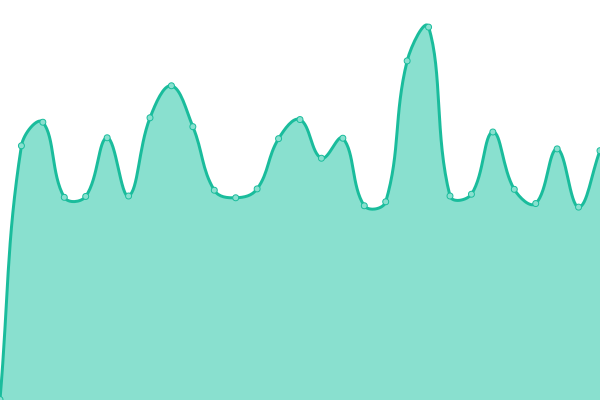 534ms
     
 | 

<a href="https://status.fediverse.kr/history/trpg-o-xyz">99.82%</a>
    

|  [s.mysw.moe](https://s.mysw.moe/nodeinfo/2.0) | 🟩 Up | [s-mysw-moe.yml](https://github.com/revinet-status/k-fediverse-status/commits/HEAD/history/s-mysw-moe.yml) | 

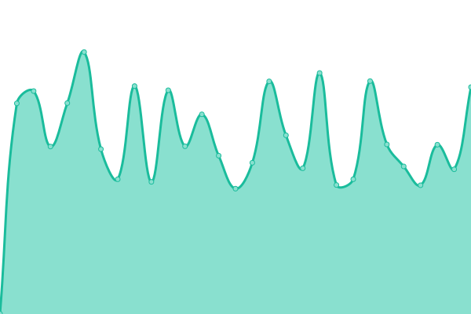 960ms
     
 | 

<a href="https://status.fediverse.kr/history/s-mysw-moe">100.00%</a>
    

|  [buttersc.one](https://buttersc.one/nodeinfo/2.0) | 🟩 Up | [buttersc-one.yml](https://github.com/revinet-status/k-fediverse-status/commits/HEAD/history/buttersc-one.yml) | 

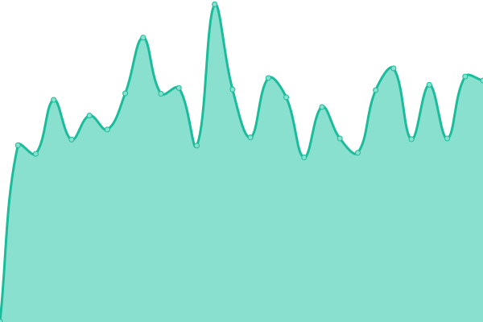 691ms
     
 | 

<a href="https://status.fediverse.kr/history/buttersc-one">100.00%</a>
    

|  [stella.place](https://stella.place/nodeinfo/2.0) | 🟩 Up | [stella-place.yml](https://github.com/revinet-status/k-fediverse-status/commits/HEAD/history/stella-place.yml) | 

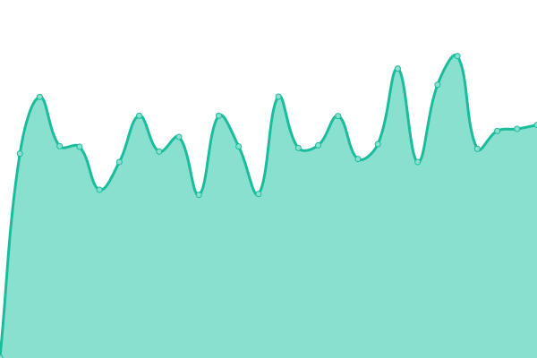 837ms
     
 | 

<a href="https://status.fediverse.kr/history/stella-place">100.00%</a>
    

|  [iqhina.org](https://iqhina.org/nodeinfo/2.0) | 🟩 Up | [iqhina-org.yml](https://github.com/revinet-status/k-fediverse-status/commits/HEAD/history/iqhina-org.yml) | 

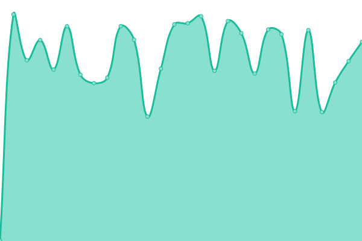 673ms
     
 | 

<a href="https://status.fediverse.kr/history/iqhina-org">100.00%</a>
    

|  [sharlayan.in](https://sharlayan.in/nodeinfo/2.0) | 🟩 Up | [sharlayan-in.yml](https://github.com/revinet-status/k-fediverse-status/commits/HEAD/history/sharlayan-in.yml) | 

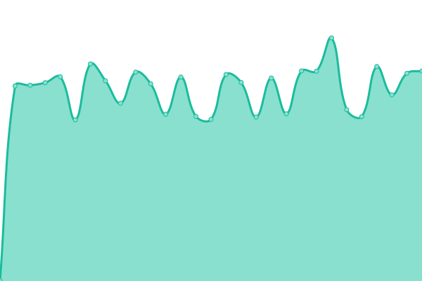 638ms
     
 | 

<a href="https://status.fediverse.kr/history/sharlayan-in">100.00%</a>
    

|  [Cerulean.ink](https://cerulean.ink/nodeinfo/2.0.json) | 🟥 Down | [cerulean-ink.yml](https://github.com/revinet-status/k-fediverse-status/commits/HEAD/history/cerulean-ink.yml) | 

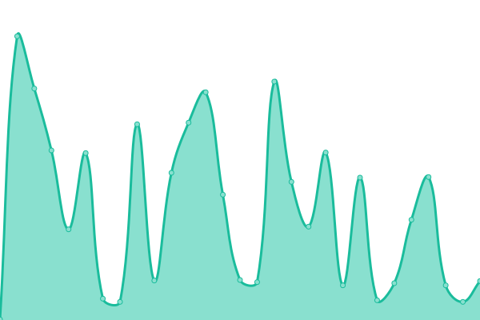 308ms
     
 | 

<a href="https://status.fediverse.kr/history/cerulean-ink">0.00%</a>
    

|  [KitsuneSoba](https://kitsunesoba.com/nodeinfo/2.0) | 🟩 Up | [kitsune-soba.yml](https://github.com/revinet-status/k-fediverse-status/commits/HEAD/history/kitsune-soba.yml) | 

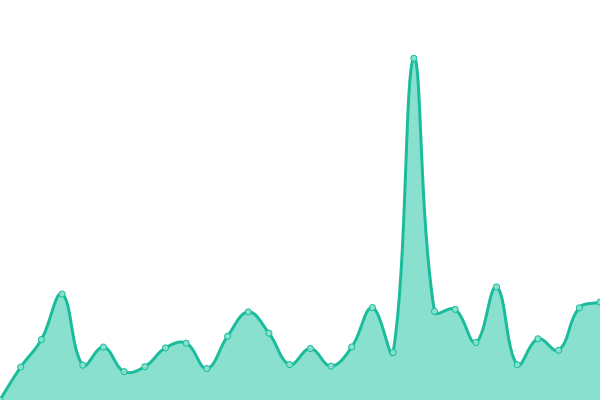 660ms
     
 | 

<a href="https://status.fediverse.kr/history/kitsune-soba">100.00%</a>
    

|  [Catsword.social](https://catswords.social/nodeinfo/2.0) | 🟩 Up | [catsword-social.yml](https://github.com/revinet-status/k-fediverse-status/commits/HEAD/history/catsword-social.yml) | 

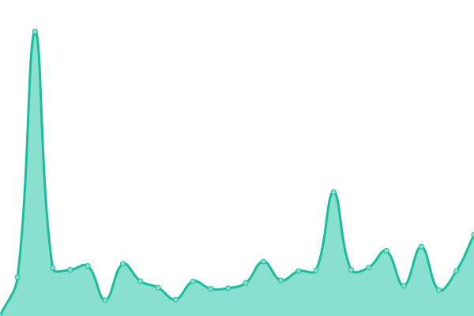 704ms
     
 | 

<a href="https://status.fediverse.kr/history/catsword-social">100.00%</a>
    

|  [duk.space](https://duk.space/nodeinfo/2.0) | 🟩 Up | [duk-space.yml](https://github.com/revinet-status/k-fediverse-status/commits/HEAD/history/duk-space.yml) | 

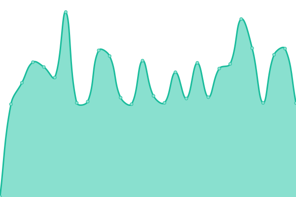 592ms
     
 | 

<a href="https://status.fediverse.kr/history/duk-space">100.00%</a>
    

|  [mst.canor.kr](https://mst.canor.kr/nodeinfo/2.0) | 🟩 Up | [mst-canor-kr.yml](https://github.com/revinet-status/k-fediverse-status/commits/HEAD/history/mst-canor-kr.yml) | 

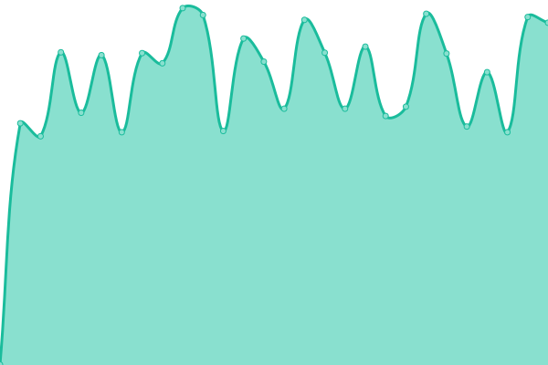 857ms
     
 | 

<a href="https://status.fediverse.kr/history/mst-canor-kr">100.00%</a>
    

|  [msk.canor.kr](https://msk.canor.kr/nodeinfo/2.0) | 🟩 Up | [msk-canor-kr.yml](https://github.com/revinet-status/k-fediverse-status/commits/HEAD/history/msk-canor-kr.yml) | 

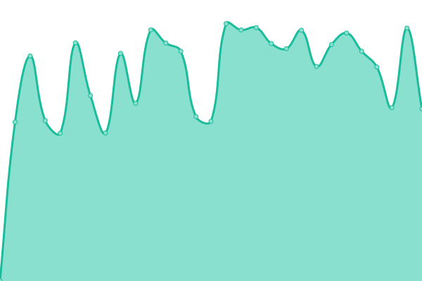 833ms
     
 | 

<a href="https://status.fediverse.kr/history/msk-canor-kr">100.00%</a>
    

|  [serafuku.moe](https://serafuku.moe/nodeinfo/2.0) | 🟩 Up | [serafuku-moe.yml](https://github.com/revinet-status/k-fediverse-status/commits/HEAD/history/serafuku-moe.yml) | 

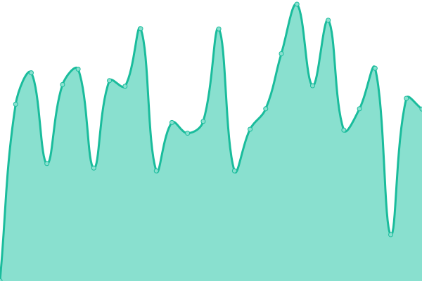 661ms
     
 | 

<a href="https://status.fediverse.kr/history/serafuku-moe">99.62%</a>
    

|  [Yodangang.Express](https://yodangang.express/nodeinfo/2.0) | 🟩 Up | [yodangang-express.yml](https://github.com/revinet-status/k-fediverse-status/commits/HEAD/history/yodangang-express.yml) | 

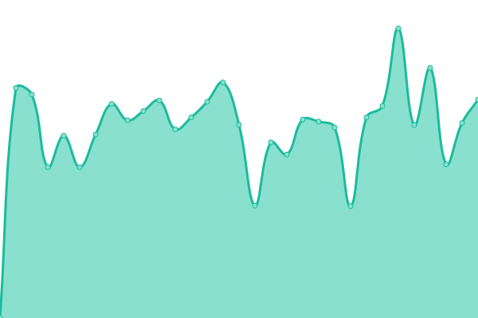 1218ms
     
 | 

<a href="https://status.fediverse.kr/history/yodangang-express">86.54%</a>
    

|  [Nekoplanet](https://nekoplanet.xyz/nodeinfo/2.0) | 🟩 Up | [nekoplanet.yml](https://github.com/revinet-status/k-fediverse-status/commits/HEAD/history/nekoplanet.yml) | 

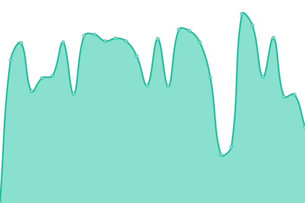 245ms
     
 | 

<a href="https://status.fediverse.kr/history/nekoplanet">100.00%</a>
    

|  [worldcone](https://worldc.one/nodeinfo/2.0) | 🟩 Up | [worldcone.yml](https://github.com/revinet-status/k-fediverse-status/commits/HEAD/history/worldcone.yml) | 

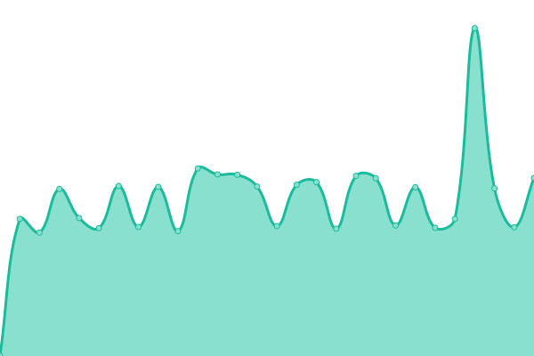 878ms
     
 | 

<a href="https://status.fediverse.kr/history/worldcone">99.68%</a>
    

|  [i.peacht.art](https://i.peacht.art/nodeinfo/2.0) | 🟥 Down | [i-peacht-art.yml](https://github.com/revinet-status/k-fediverse-status/commits/HEAD/history/i-peacht-art.yml) | 

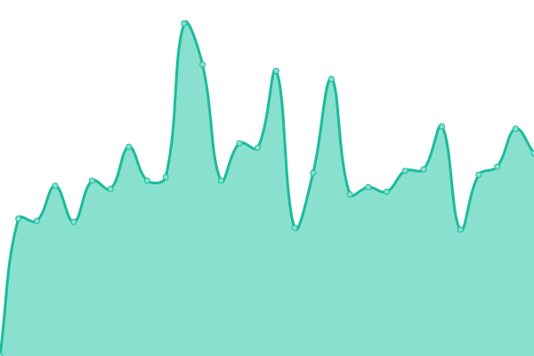 0ms
     
 | 

<a href="https://status.fediverse.kr/history/i-peacht-art">0.00%</a>
    

|  [rlidea.com](https://rlidea.com/nodeinfo/2.0) | 🟩 Up | [rlidea-com.yml](https://github.com/revinet-status/k-fediverse-status/commits/HEAD/history/rlidea-com.yml) | 

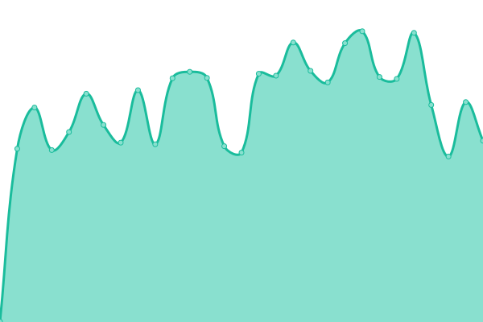 771ms
     
 | 

<a href="https://status.fediverse.kr/history/rlidea-com">100.00%</a>
    

|  [leuno.kr](https://leuno.kr/nodeinfo/2.0) | 🟥 Down | [leuno-kr.yml](https://github.com/revinet-status/k-fediverse-status/commits/HEAD/history/leuno-kr.yml) | 

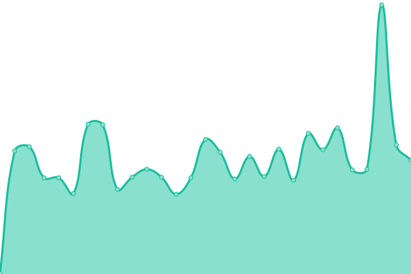 214ms
     
 | 

<a href="https://status.fediverse.kr/history/leuno-kr">0.00%</a>
    

|  [mi.rerac.dev](https://mi.rerac.dev/nodeinfo/2.0) | 🟩 Up | [mi-rerac-dev.yml](https://github.com/revinet-status/k-fediverse-status/commits/HEAD/history/mi-rerac-dev.yml) | 

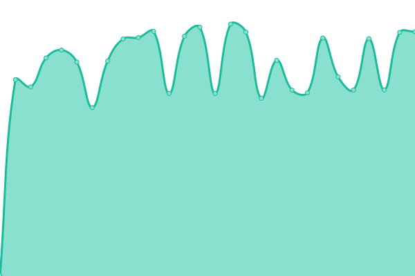 1045ms
     
 | 

<a href="https://status.fediverse.kr/history/mi-rerac-dev">97.32%</a>
    

|  [parfait.day](https://parfait.day/nodeinfo/2.0) | 🟩 Up | [parfait-day.yml](https://github.com/revinet-status/k-fediverse-status/commits/HEAD/history/parfait-day.yml) | 

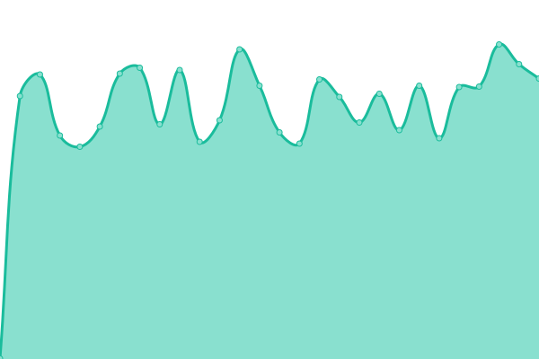 600ms
     
 | 

<a href="https://status.fediverse.kr/history/parfait-day">100.00%</a>
    

|  [whitelily.blue](https://whitelily.blue/nodeinfo/2.0) | 🟩 Up | [whitelily-blue.yml](https://github.com/revinet-status/k-fediverse-status/commits/HEAD/history/whitelily-blue.yml) | 

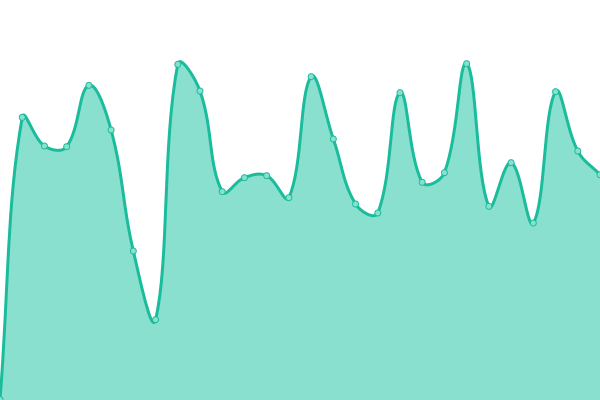 767ms
     
 | 

<a href="https://status.fediverse.kr/history/whitelily-blue">100.00%</a>
    

|  [sekai.social](https://sekai.social/nodeinfo/2.0) | 🟩 Up | [sekai-social.yml](https://github.com/revinet-status/k-fediverse-status/commits/HEAD/history/sekai-social.yml) | 

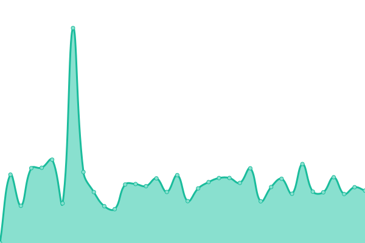 715ms
     
 | 

<a href="https://status.fediverse.kr/history/sekai-social">92.60%</a>
    

|  [yuri.garden](https://yuri.garden/nodeinfo/2.0) | 🟩 Up | [yuri-garden.yml](https://github.com/revinet-status/k-fediverse-status/commits/HEAD/history/yuri-garden.yml) | 

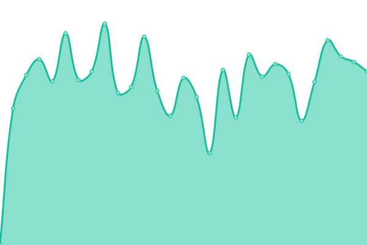 868ms
     
 | 

<a href="https://status.fediverse.kr/history/yuri-garden">100.00%</a>
    

|  [yunochi.moe](https://yunochi.moe/nodeinfo/2.0) | 🟩 Up | [yunochi-moe.yml](https://github.com/revinet-status/k-fediverse-status/commits/HEAD/history/yunochi-moe.yml) | 

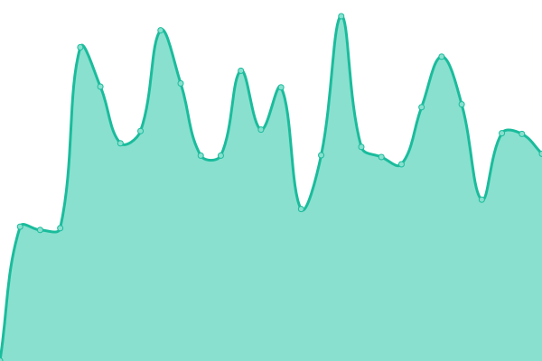 573ms
     
 | 

<a href="https://status.fediverse.kr/history/yunochi-moe">99.91%</a>
    

|  [munochi.moe](https://munochi.moe/nodeinfo/2.0) | 🟩 Up | [munochi-moe.yml](https://github.com/revinet-status/k-fediverse-status/commits/HEAD/history/munochi-moe.yml) | 

 925ms
     
 | 

<a href="https://status.fediverse.kr/history/munochi-moe">94.88%</a>
    

|  [FediverseWiki](https://wiki.mastodon.kr/w/api.php?action=query&meta=siteinfo&siprop=statistics&format=json) | 🟩 Up | [fediverse-wiki.yml](https://github.com/revinet-status/k-fediverse-status/commits/HEAD/history/fediverse-wiki.yml) | 

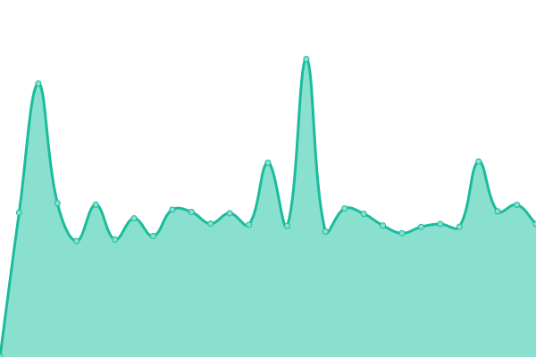 650ms
     
 | 

<a href="https://status.fediverse.kr/history/fediverse-wiki">100.00%</a>
    

|  [interstellar.flights](https://ap.interstellar.flights/) | 🟩 Up | [interstellar-flights.yml](https://github.com/revinet-status/k-fediverse-status/commits/HEAD/history/interstellar-flights.yml) | 

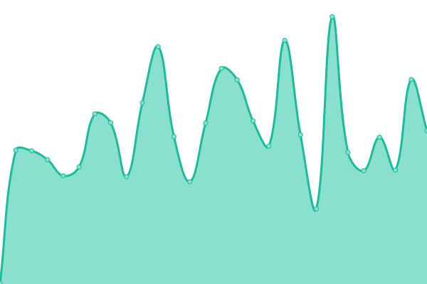 524ms
     
 | 

<a href="https://status.fediverse.kr/history/interstellar-flights">100.00%</a>
    

|  [relay.musubi.moe](https://relay.musubi.moe/) | 🟥 Down | [relay-musubi-moe.yml](https://github.com/revinet-status/k-fediverse-status/commits/HEAD/history/relay-musubi-moe.yml) | 

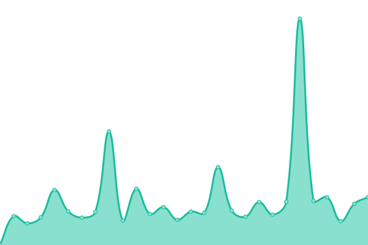 668ms
     
 | 

<a href="https://status.fediverse.kr/history/relay-musubi-moe">0.00%</a>
    

|  [relay.pointless.chat](https://relay.pointless.chat/) | 🟩 Up | [relay-pointless-chat.yml](https://github.com/revinet-status/k-fediverse-status/commits/HEAD/history/relay-pointless-chat.yml) | 

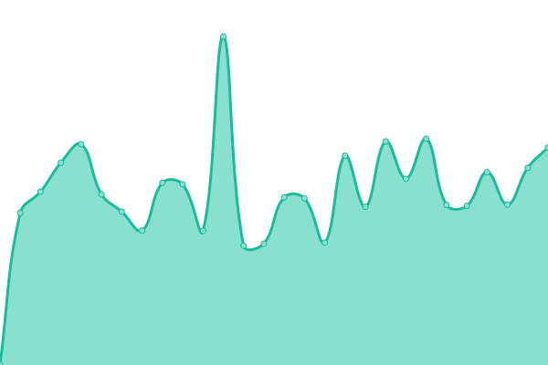 457ms
     
 | 

<a href="https://status.fediverse.kr/history/relay-pointless-chat">100.00%</a>
    

<!--end: status pages-->

[**Visit our status website →**](https://status.fediverse.kr)

## 📄 License

- Powered by: [Upptime](https://github.com/upptime/upptime)
- Code: [MIT](./LICENSE) © [Revinet Status Pages](https://status.fediverse.kr)
- Data in the `./history` directory: [Open Database License](https://opendatacommons.org/licenses/odbl/1-0/)
